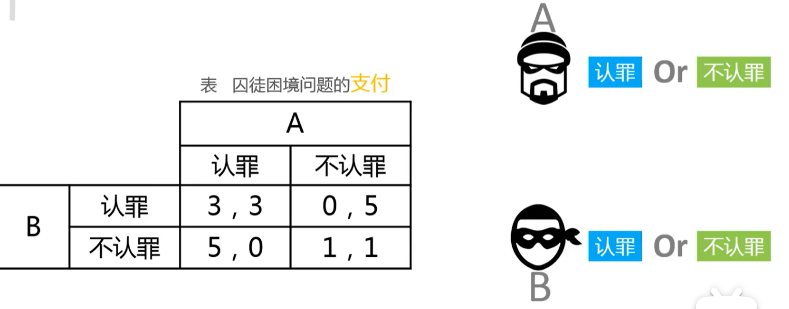
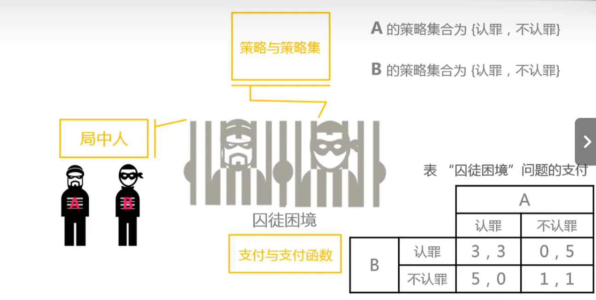
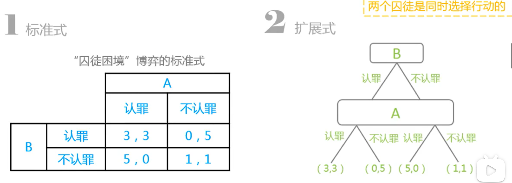
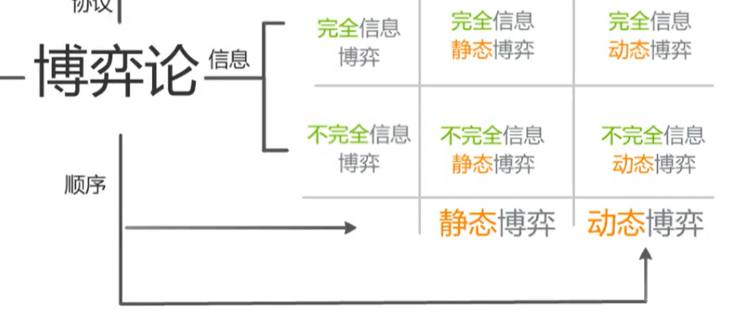

# 博弈论

## 第一讲 认识博弈论

### 一、什么是博弈论？

> ### 作为运筹学的分支
>
> > 作为运筹学的一个分支，是一门以数学为基础，研究发生对抗与冲突时如何选择最优策略的学问。
>
> ### 一门学科
>
> > 作为一门学科的创立，是以数学家约翰·冯·诺依曼和经济学家奥斯卡·摩根斯特恩在1944年合作出版的《博弈论与经济行为》一书为重要标志
> >
> > #### 提出了：
> >
> > > 策略型与广义型（扩展型）等基本博弈模型以及解的概念和分析方法，奠定了博弈论的基石。
>
> 是一种以数学为基础、研究发生对抗与冲突时如何选择最优策略的一门学问
> 是交互式条件下“最优理性决策”
> 精髓在于基于系统思维基础上的理性换位思考

###  二、囚徒困境

> 
>
> ### 个人理性与集体理性发生冲突
>
> > 以自我利益为目标“理性”行为导致两个囚徒得到相对较劣的收益
>
> ### 对囚徒困境问题分析的结果表明：
>
> > 个人理性通过市场机制导致社会福利最优的结论并不总是成立的。

### 三、博弈论的基本概念

#### 1、基本假设

> 即他必须并且能够充分考虑到人们之间行为的相互作用及可能的影响，能够做出合乎理性[^1]的选择。
>
> [^1]:指博弈参与者为最大化自己的目标函数，选择使其收益最大化的策略

#### 2、要素

> ### 局中人
>
> > 指博弈的参与人，又称博弈方。是博弈中能独立决策、独立行动并承担决策结果的个人或组织。只要有独立的决策和行动，便可被视为博弈方，也就是决策的主体
>
> ### 策略
>
> > 是指局中人的**行动**。一局博弈中，每个局中人都有**多个可选择**的行动，每个行动称为这个局中人的一个**策略**。
> >
> > 每一个策略都对应相应的结果，供博弈方选择的**策略**数量**越多**，博弈就越**困难**、越**复杂**。
>
> ### 策略集
>
> > 一个局中人**所有策略的集合**称为该局中人的策略集或**行动空间**，决策者在实际行动中总会选择**切实可行**的策略**付诸实施**。
> >
> > 在一局博弈中，如果局中人的个数**有限**，且每个局中人的**策略集**都是**有限集合**，则称该局博弈为“**有限博弈**”，否则称为“**无限博弈**”。
>
> ### 支付（进行判断和决策的依据）
>
> > 指每个局中人选择出策略后所获得的**收益**
> >
> > 博弈胜负的**评判**主要是靠**策略选择后的得失**来衡量
>
> ### 支付函数
>
> > 每个局中人支付依赖于自己的策略选择，也依赖于其他局中人策略选择，因此它是所有局中人策略选择的支付函数，也称为收益函数
> >
> > 本身就是某种量值，也可能是量化的某种效用
>
> ### 例题
>
> > 
>
> ### 其他要素
>
> > ### 信息
> >
> > > 信息是局中人在进行博弈时有关**其他局中人**的**特征和行动**的知识
> >
> > ### 结果
> >
> > > 结果是博弈分析者**感兴趣**的要素的**集合**
> >
> > ### 均衡
> >
> > > 均衡是所有局中人的**最优策略**形成的局势或行动的**集合**，是博弈**最可能**出现的**结果**。
> > >
> > > 在“囚徒困境”问题中，{认罪、认罪}就是其博弈的**均衡**。

#### 3、表述模型

> ### 标准式
>
> > 适合表示二人、三人博弈的列表形式
>
> ### 扩展式
>
> > 可表示多人博弈（动态多人博弈）的博弈树的形式
>
> ### 特征函数式
>
> > 出现在合作博弈的一半表示中
>
> ### 任何只要能写成标准式就能改写成扩展式
>
> > 

#### 4、分类

> #### 1、合作博弈和非合作博弈
>
> #### 2、完全信息博弈和不完全信息博弈
>
> #### 3、静态博弈和动态博弈
>
> #### 4、常和博弈和非常和博弈
>
> #### 5、结盟博弈和不结盟博弈
>
> 
>
> 第二讲我们主要讲完全信息静态博弈

## 第二讲  纳什均衡（非合作博弈均衡）

### 一、占优策略、占优策略均衡

> ### 严格占优/占劣策略
>
> > 一般来说，在一个二人博弈中，考察一个局中人A策略集中的任意两个策略A1、A2，如果不论对方采取何种策略，局中人A的策略A1的收益总是严格大于策略A2的收益，我们就称策略A2被策略A1严格占优，或称策略A1为严格占优策略（Strictly dominant strategy），称策略A2为严格劣策略（Strictly dominated strategy）；
>
> ### 占优策略/占劣策略
>
> > 如果对方不论采取何种策略，该局中人的策略A1的收益总是大于或等于（至少有一个大于）策略A2的收益，我们就称策略A2被策略A1占优，或称策略A1为占优策略（Dominant Strategy），策略A2为劣策略（Dominated Strategy）
>
> ### 占优策略均衡（非合作均衡）
>
> > 当一个博弈中的每一位参与者都选择了各自的占优策略时，相应的博弈结果就是占优策略均衡。
> >
> > 不管所有其他参与人选择什么策略，这个参与人的占优策略都是他自己的最优策略

### 二、纳什均衡、合作均衡

> ### 纳什均衡
>
> > 由所有参与人的最优策略组成的策略组合。此策略组合也被称为纳什均衡点。
> >
> > 每一个理性的参与者都不会有单独改变策略的动机，因为局中的每一个博弈者都不可能因为单方面改变自己的策略而增加获益。
>
> ### 合作均衡
>
> > 各方协调行动，以求共同的支付最优化的策略而达到的结果
> >
> > 一般来说，如果博弈的参与者都能够**履行**协商后的策略，则他们选择的策略就构成了合作均衡。
>
> ### 纳什均衡与合作均衡相悖
>
> > 

#### 